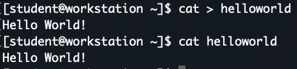

== Working with the Shell

In this module we will begin working with the shell.  We will not be accessing a graphical user interface, in which case we would be using a _terminal emulator_, much like the _command_ app on Windows.

There are many shell programs but, the default we will be using is the _bash_ shell which stands for _Bourne Again Shell_ and simply called _bash_.

When we used _SSH_ to access the command-line in our lab workstation instance, we were placed into _bash_ at what is called the _shell prompt_.

=== Shell Prompt

The _shell prompt_ usually includes your _username@machinename_ followed by the working directory and a dollar sign.

Now we can start the lab.

=== Running some initial commands

To test out our _CLI_ and get used to the _shell prompt_, we can try out a few simple commands.

----
NOTE
The bash shell is very similar to the command-line interpreter found in Microsoft Windows.  Bash is provides a powerful scripting language similar to Windows PowerShell.  If you are using a Terminal utility on Apple macOS, bash is the default shell.
----

Shell commands have three basic parts:

* The _command_ to run
* _Options_ to adjust the behavior of the command
* _Arguments_, which are targets of the command

The _command_ is the name of the program to run.  It may be followed by one or more _options_, which adjust the behavior of the command or what it will do.  Options normally start with one or two dashes (_-a_ or _--all__) to distinguish them from arguments.  Commands may also be followed by one or more _arguments_, which often indicate a target that the command should operate upon.

*Let's run a few simple commands.*

Although we know who the current user is by looking at the prompt, we can find out explicitly by asking *whoami*:

We can also explicitly find out our present working directory using the *pwd* command:

image::./images/pwd-command.png[]

The *cal* command displays a calendar of the current month:

image::./images/cal-command.png[]

If we want to see the current *date* we can issue *date* command:

We can format the date using the plus sign (*+*):

image::./images/date-filter-command.png[]

You may have noticed by this point that your terminal, _shell prompt_, window is getting a little cluttered.
You may want to clean this up and can issue the *clear* command to do so.

If you want to find a command you issued before, we can find that by issuing the *history* command:

image::./images/history-command.png[]

A quick way to execute a previous command, is to issue the *history* command and then issue a *bang* with the history number:

Let's explore a couple of other useful commands to get going.

If we wanted to determine how much free space was on our disk, we would enter the *df* command:

image::./images/df-command.png[]

Now let's say we wanted to determine how much *free* memory we had available to run programs:

image::./images/free-command.png[]

If you want to *exit* from the current terminal, just issue the *exit* command.
Let's not do this right now because we will be continuing to use this session during the lab.

=== Some Basic File Manipulation

Let's learn some basic file manipulation using the *cat* command.

We can't really start off without the prerequisite "Hello World!".

Using *cat* we can enter data into a file.  Text and other files do not require an extension like in Windows.

Issue the command $ cat > helloworld

This will create a file called "helloworld" and allow you to start entering text.

Just type in _Hello World!_ and hit Ctrl+D to terminate the line.

We now have a file with the contents you entered.

Next *cat* the file to see the contents:

Now lets say we have create a second file.

Issue the command $ cat > helloworld2

Enter some unique text and issue Ctrl+D to terminate the line.

Let's now use *cat* to concatenate the files into a third file:

image::./images/concatenate-files.png[]

Perhaps you might want to see the line numbers in a file:

Now let's append the contents of one file to another file:

What is we just wanted to see the first few lines or last few lines of a file?

We could use the *head* or *tail* command.  By default, these commands display only 10 lines of the file.
We would have to use the *-n* option to allow a different number of lines to be specified.

What if we just wanted to get the number of lines, words and characters in a file?
We could issue the *wc* command and with some options like *-l*, *-w*, or *-c* we could display only the number of lines,
 number of words or number of characters.

=== Making Life Easier For Ourselves

*Tab Completion*

*Editing a Command Line*

=== Conclusion

In this workshop module, we have:

* Logging into a bash shell
* Learned the basic syntax of issuing commands from the command-line in a bash shell
