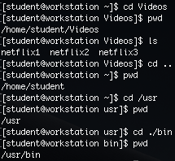
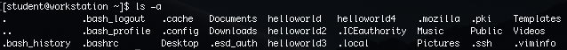
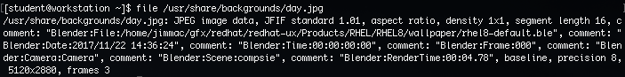

== Navigation and the File System

With our new found knowledge of the shell, let's learn a few things about
navigating the filesystem on Linux.

=== The File System

Linux is organized around files in a _hierarchical directory structure_.

In Windows, we would call this a tree of folders but, on Linux they are referred to as directories.

The top level directory is referred to as the _root directory_.

Linux has a single file system tree and devices such as USB or other drives
are _mounted_ at some place in the directory tree.

On Linux, all files are stored in this file system and organized into a file-system hierarchy.

The _root_ is said to be at the top of the hierarchy and the branches of directories
and subdirectories stretch below the root.  It is therefore, considered and _inverted_ tree.

The / directory is the root directory at the top of the hierarchy.

This is overloaded and the / character is also used as a directory separator
in file names.

The following table lists some of the most important directories in RHEL.

image:./images/linux-directories.png[]

=== Navigation

*Present working directory*

We have already used this command but, let's review it again.

To get the present working directory, we will _print working directory_ using the _pwd_ command:

This is actually our _HOME_ directory and we know this because the command prompt tells us with the _~_ symbol
as well.

Each user account has it's own _home_ directory which is where we will write most of our files.

*Listing Contents and Changing Directories*

One of the most widely used commands is to list the contents of a directory using the _ls_ command.

Often times we will want to list the contents of a directory or change the current working directory so we are
said to be working with either _absolute_ or _relative_ paths in the tree of directories.

A _path_ of a file or directory specifies its unique file system location.
Following a file path traverses one or more named subdirectories, delimited by a forward slash /, until
the destination is reached.

Directories contain other files and other subdirectories.

Let's test this out by navigating using *pwd* to display the full path of the current working directory.
Then the *ls* command to list the directory contents and the *cd* command to change directories and follow the path.

What just happened here:

. We checked the current working directory
. We listed the contents of the current working directory
. We changed directory to the /Videos directory
. We checked the current working directory
. We listed the contents (nothing)
. We changed directory up one level by using the (..) operation and the down to the /Documents directory
. We listed the contents (nothing)
. We changed directory back to the HOME directory using the (~)

=== Relative Paths

Absolute pathnames start from the root directory and lead to a destination.  But a _relative pathname_ starts
from the working directory.

To do this we use the . (dot) and the .. (dot dot) symbols.

the . symbol always refers to the working directory.

The .. symbol always refers to the working directory's parent directory.

With this knowledge, we can practice navigating using the change directory command *cd*.

=== More Navigation

Navigating the directory tree is a very powerful feature.

In order to explore some more of the *list* feature, we will have to learn
how to create some files using the *touch* command.

The *touch* command updates a file's timestamp to the current date and time without otherwise
modifying the file.  Using this feature, we can create some empty files for practice.

In essence, *touching* a file name causes a file to be created with that name.  The file is *empty* when it is *touched*.

Using the *ls* command, we have multiple options for displaying the attributes on files and determining what is in directories
and subdirectories.

*ls* *-l* is referred to as _long listing format_.

image:./images/long-listing-format.png[]

*ls -a* is referred to as _all files, including hidden files_.

We can combine options and _long list all files_.

We can also recursively list all files including what is in subdirectories using the *-R* option.

=== _ls_ options
|===
|Option|Long Option|Description
|-a|--all|Lists all files.  This includes all hidden files (files beginning with a period).
|-d|--directory|Lists the contents of the directory but not the directory itself.  When used with the -l option, details about the directory rather than the contents will be displayed
|-F|--classify|Appends an indicator character to the end of each listed name
|-h|--human-readable|Displays file sizes in human-readable format rather than bytes
|-l||Displays results in long format
|-r|--reverse|Displays results in reverse order.
|-s||Sorts results by file size
|-t||Sorts by modification time
|===

[NOTE]
.Filenames
====
* When a filename begins with a period (.), it is considered hidden.  This means that the *ls* command will only display it if using the *ls -a* option.
* Filenames and commands are case sensitive
* Linux has no concept of a "file extension"
* Linux supports long filenames that may contain embedded spaces and punctuation but, limit the punctuation characters to period, dash and underscore.
====

=== Quickly Viewing File Contents

Although we just stated that Linux does not use a files extension to determine it's _type_, we would still like to determine a what the contents are.

To do this, we can use the _file_ command.

Let's list the file contents of a known file on RHEL:

$ file /usr/share/backgrounds/day.jpg

[NOTE]
.How what?
====
How did we even find that file in the first place?  Well, using the _find_ command of course.

$ sudo find / -iname '*.jpg'

Try it out and see what you _find_.
====

=== Viewing File Contents with *less*

We use the *less* command to view text files.

In Linux, the ability to read and search configuration files gives us insight into how the system is working.

Most automation files are actually scripts which also are kept in text and many times we want to examine the file without opening it for editing.

The *less* command is relatively simple to use:

$ less _filename_

Let's explore a file used to define all the system's user accounts.  We don't want to edit it but, we do want to navigate in it and search it.

$ less /etc/passwd

With the file contents displayed, we can use the following commands to navigate within it:
|===
|Command|Action
|page up or b|Scroll back one page
|page down or Spacebar|Scroll forward one page
|Up arrow|Scroll up one line
|Down arrow|Scroll down one line
|G|Move to the end of the text file
|g|Move to the beginning of the text file
|/characters|Search forward to the next occurance of _character_
|n|Search for the next occurance of the previous search
|h|Display the help screen
|q|Quit _less_
|===

=== Conclusion

In this workshop module, we have:

* Learned about the file and directory hierarchy in Linux
* Learned the basic syntax of navigating the directory hierarchy
* Learned how to view the contents of a file

