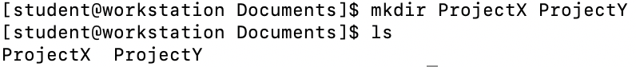
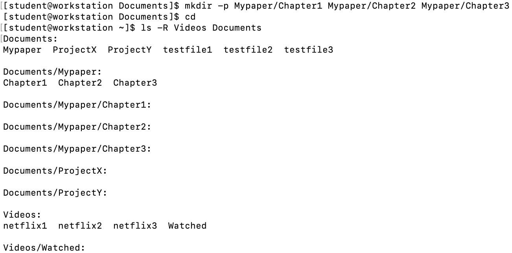
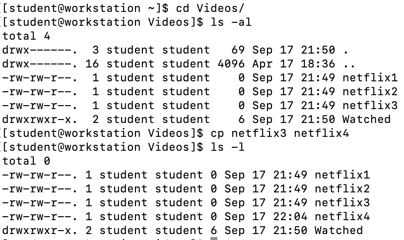
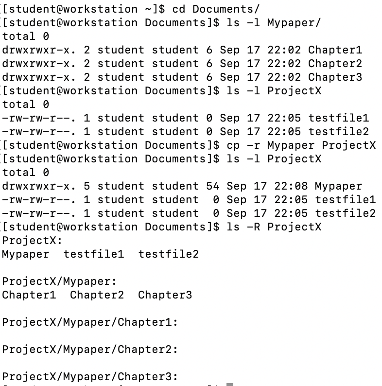
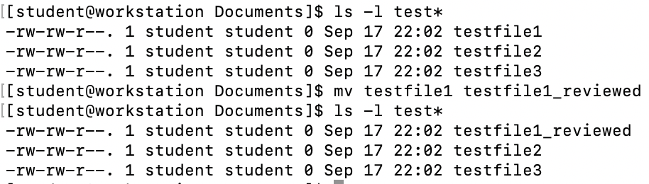
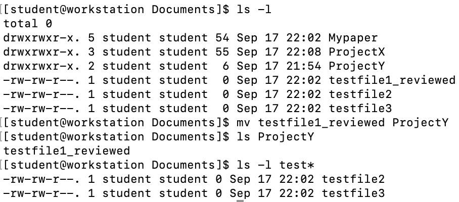
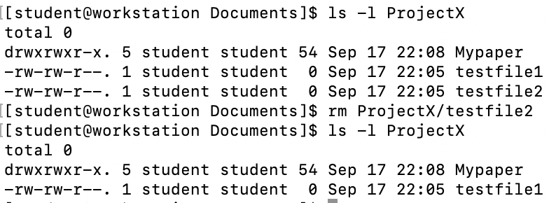

== Manipulating Files

Since we are working on becoming power users, we should learn how to use several of the most common commands.

If you are coming from a Windows background, you ask yourself, what can't I do with the CLI
that can't be done with a graphical file manager?

Easy, I can automate it.  For example, how could we copy all the HTML files from one directory
to another - but only those that do not exist in the destination directory or are newer than
the versions in the destination directory?

With a file manager, not so easy.  With the CLI?

$ cp -u *.html destination

.Here are the common command-line management commands we will review:
|===
|Command|Syntax|Description
|mkdir|mkdir _directory_|Create a directory
|cp|cp _file new-file_|Copy a file
|cp -r|cp -r _directory new-directory_|Copy a directory and its contents
|mv|mv _file new-file_|Move or rename a file or directory
|rm|rm _file_|Remove a file
|rm -r|rm -r _directory_|Remove a directory containing files
|rmdir|rmdir _directory_|Remove an empty directory
|===

=== Using Wildcards

Prior to getting into the commands, it will be useful to understand wildcards.

The shell uses filenames so much, it provides special characters to help rapidly specify groups of filenames.

These special characters are called _wildcards_.

Using wildcards allows us to select filenames based on patterns.

.Here is a list of wildcards and what they select:
|===
|Wildcard|Matches
|*|Any characters
|?|Any single character
|[_characters_]|Any character that is a member of a set of _characters_
|[!_characters_]|Any character that is not a member of the set of _characters_
|\[[:_class_:]]|Any character that is a member of the specified _class_
|===

.What are the character classes?
|===
|Character Class|Matches
|[:alnum:]|Any alphanumberic character
|[:alpha:]|Any alphabetic character
|[:digit:]|Any numberal
|[:lower:]|Any lowercase letter
|[:uppder:]|Any uppercase letter
|===

.So let's see some wildcard examples we can embed into our commands:
|===
|Pattern|Matches
|*|All files (almost like Windows but, better!)
|h*|Any file beginning with _h_
|c*.dat|Any file beginning with _c_ followed by any characters and ending with _.dat_
|Pete???|Any file beginning with _Pete_ followed by exactly three characters
|[abc]*|Any file beginning with either _a, b, or c_
|/[![:digit:]]*|Any file not beginning with a numeral
|===

=== Create Directories

Using the *mkdir* command, we can create one or more directories or subdirectories.
*mkdir* will fail when the directory already exists or, if we are try to create a subdirectory in a directory
that does not yet exist.

Let's create a subdirectory in the *Videos* directory called *Watched*.

[NOTE]
This failed because we misspelled the directory.  You will find, eventually, there is a _-p_ option which could have been used.
This would have been a problem because the _mkdir -p_ command+option would have unintended consquences such as generating a new
directory structure without generating an error message as it creates _missing_ parent directories.

So lets do it the correct way:

Now let's create multiple directories under a parent directory.  Using *mkdir* with a space-delimited list of directory names,
we can create multiple subdirectories in the /home/student/Documents directory.

This can get interesting as we can create multiple parent and subdirectories using that *mkdir -p* command+option.

Notice how the _-p_ option created the missing parent directory _Mypaper_.

=== Copy Files

Using *cp* commands, we can copy files to a directory.

[NOTE]
If the destination file already exists, the *cp* command will overwrite the file.

We can copy multiple files with the same command but, by default the *cp* command ignores directories.

We can copy files to the current working directory.

And we can copy the _contents_ of one directory to another.

=== Move Files

Moving a file moves it from one location to another.  This can also be used to rename a file with the file contents
remaining unchanged.

Now let's move a file to a different directory.

=== Removing Files

We've created a lot of files and directories here so let's explore the *rm* command to remove them.

[NOTE]
By default, the *rm* command will not remove directories with files in them.

[NOTE]
There is no undelete or "trash bin".  If you delete it, it's gone.

Remove a subdirectory file.

Remove a subdirectory recursively (it contains files).

image:./images/rmprojectx.png[]

.Some other options to remove files and directories
|===
|Option|Description
|-f|Force remove
|-d|Equivalent to rmdir
|-i|Interactively prompt for confirmation (if used with -f, the -f will take precedence)
|===

=== Conclusion

In this workshop module, we have:

* Learned how to manage files using the most common file and directory commands
* Learned about several of the options available to the most common commands

