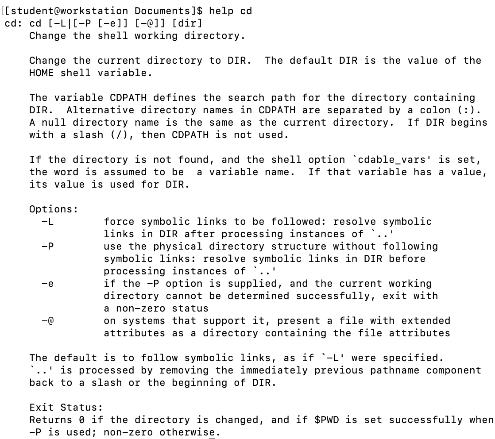
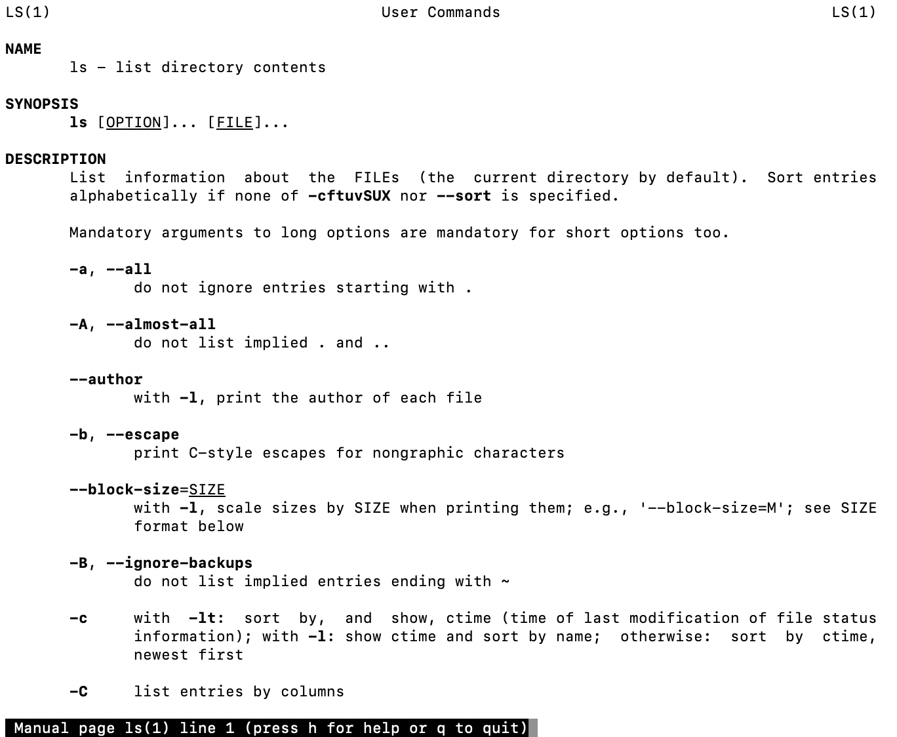

== Understanding Commands

We have now worked with several commands, so now would be a good time to get a better understanding of
how we can find out additional information about commands to help ourselves out.

=== How do we define commands

Commands can be one of four things:

* *An executable program* or a binary written in a compiled or scripting language such as C or Python.
* *A built in shell command* such as those supported by bash and called a _shell builtin_ such as the _cd_ command.
* *A shell function* which are small shell scripts usually used for configuring the environment
* *An alias* which is a command that we define and typically built from other commands

=== Commands used to understand commands

|===
|Command|Description
|type|Display how a command name is interpreted
|which|Display which executable will be executed
|man|Display manual pages (help)
|apropos|Display a list of appropriate commands
|info|Display a command's info entry
|whatis|Display a brief description of a command
|alias|Creates an alias for a command
|===

=== type command

Displays the kind of command the shell will execute.

=== which command

Many times we install multiple versions of something on the system.  e.g. Java or Python.

We can determine which program and the location by using the _which_ command.

=== Getting help

help is a shell builtin and can be accessed as a command or as an option typically.

help - as a command:

help - as an option:

=== man pages (manual page)

On Linux, most programs have a formal piece of documentation called a _manual page_ or _man page_.

Man pages are executed with the command format:

man _program_

This is documentation and beyond what you will get from _help_.  Usually it consists of a title, synopsis and description of the command
with a listing of all the options.

.Man page
|===
|Section|Content
|1|User commands
|2|Programming interfaces for kernel system calls
|3|Programming interfaces to the C library
|4|Special files such as device nodes and drivers
|5|File formats
|6|Games and amusements
|7|Miscellaneous
|8|System admin commands
|===

Portion of the man page for the _ls_ command:

If the information is too much to scroll through you can search with a */* or list the section explicitly you are looking for.

We could issue the following command:

$ man 5 passwd

This would result in:

=== Appropriate commands

What if we could also search man pages for a search term to find an _appropriate_ command?

We can:

[NOTE]
If nothing appropriate is returned, it is probably because this is a fresh install and the man pages are not indexed.

Just run *$ sudo mandb* to update the man page index.

=== whatis command

You can also get a one line description of a command.

=== info command

You will find that in open source, there are alternatives to everything.  The GNU project has an alternative to man pages called
_info pages_ that are sometimes easier to read than _man pages_.

Just execute _info_ followed by the command:

$ info _command_

For instance, information on _ls_ would be:

$ info ls

And yield:

image:./images/infols.png[]

=== Using alias

We can also create our own commands with _alias_.

We can use a command line trick to put more than one command on a line by separating each command with a semicolon character as so:

_command1; command2; command3_

If we want to alias this, we can but first it's always good to check to see if your alias already exists:

We found a word for our alias:

Now lets alias it:

This has the structure:

alias _name='string'_

What about it's type?

image:./images/typefoo2.png[]

And what do we do if we want to remove the alias?

=== Conclusion

In this workshop module, we have:

* Learned how to find information about commands to assist us making the right decisions
