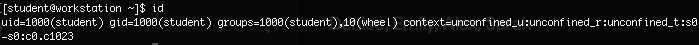
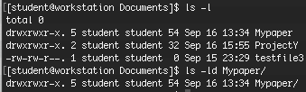
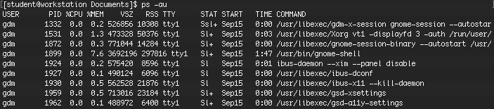

== Permissions

Since we now know how to manipulate files and directories, it would be useful to understand how different user accounts
have security boundaries and how programs have permissions to run commands.

On Linux, there are three main types of user accounts: the _superuser_, _system users_, and _regular users_.

* The _superuser_ account is for administration of the system.  All users have a human readable name and a _user ID_ or _UID_ assigned to them.
The _superuser_ is _root_ and the account has a UID 0.  The superuser has full access to the system.
* The system has _system user_ accounts which are used by processes to provide supporting services.  These processes, referred to as _daemons_
do not need to run as the superuser.  They are usually assigned non-privileged accounts that allow them to secure their files and other resources from each other
and from regular users on the system.
* Most users are _regular user_ accounts which they use for normal work.  Like system users,
regular users have limited access to the system.

=== Owner information

We can use the _id_ command to show information about the currently logged in user:

To get information about another user, we would do it in the form of:

$ id _other user_

We can view teh owner of a file by using the *ls -l* command+option.  To view teh owner of a directory,
we would issue the *ls -ld* command:

To view process information, we would use the *ps* command.  This defaults to only show processes in the current shell.
If we add *a* as an option to view all processes with a terminal, we could also see what users are associated
with those processes by including a *u* option:

=== Groups

A collection of users is called a group and that group is said to share access to files and other system resources.
Groups can be used to grant access to files to a set of users instead of a single user.

By default, the mapping of group names to *GIDs* is defined in a database of group account information and is in the */etc/group*
file to store info about local groups.

Issue the following command:

$ cat /etc/group

Each line contains information about one group.  Each group entry is divided into four colon separate fields:

. Group name for the group
. Obsolete group password field.  It should always be *x*
. The GID number for the group
. A list of users who are members of the group as a supplementary group.

=== Types of Groups

There are two types of groups; primary groups and supplementary groups

Every user has exactly one primary group.  For local users, this is the group listed by GID number in the */etc/passwd* file.
This is the group that will own new files created by the user.

Users may also have _supplementary groups_ and membership is determined by the */etc/group* file.

=== Conclusion

In this workshop module, we have:

* Learned about several of the user types and groups on a Linux system
