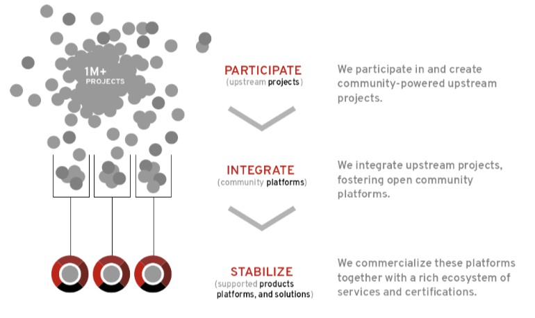
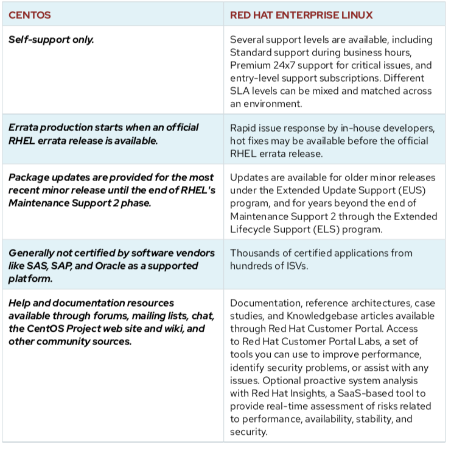

:gitrepo: https://github.com/petebowden/Linux
:doctype: book
:sectnums:
:sectnumlevels: 3
ifdef::env-github[]
:tip-caption: :bulb:
:note-caption: :information_source:
:important-caption: :heavy_exclamation_mark:
:caution-caption: :fire:
:warning-caption: :warning:
endif::[]
# Linux
= Red Hat Linux
:toc:
:toc-placement!:

toc::[]

# Introduction

*What is this lab about*

The intent of this lab is to introduce the user to Linux, the Linux command-line and some preparation to set the user on the path towards becoming a Linux command-line power user.

*What this lab is not about*

This is not a Linux Admin lab.  This lab does not replace the training available from Red Hat for Linux Admins.

*What is it about Linux?*

* Linux is _open source_
* Linux has a powerful and scriptable _command-line interface_ _(CLI)_
* Linux is _modular_

What is a Linux distribution?

* Distributions consist of a Linux kernel and supporting user space programs
* Distributions can be small and single-purpose or include thousands of open source programs
* Distributions must provide a means of installing and updating the distribution and it components
* The provider of the distribution must support that software and is typically part of the community developing the software

What are the differences between Fedora, RHEL, Centos and derivatives?

*Why not just use CentOS again?*

# Lab Environment

Before starting, let's get familiar with the link:lab-environment.adoc[lab environment] setup.

# Outline
[#toc]
. link:./1shell.adoc[Working with the shell]
. link:./2navigation.adoc[Navigation and the File System]
. link:./3manipulatingfiles.adoc[Manipulating Files]
. link:./4understandingcommands.adoc[Understanding Commands]
. link:./5permissions.adoc[Permissions]
. link:./6packagemanagement.adoc[Package Management]
. link:./7webconsole.adoc[Web Console]
. link:./8wayland.adoc[Wayland]
. link:./podman.adoc[Podman]
. link:./buildah.adoc[Buildah and Skopeo]
